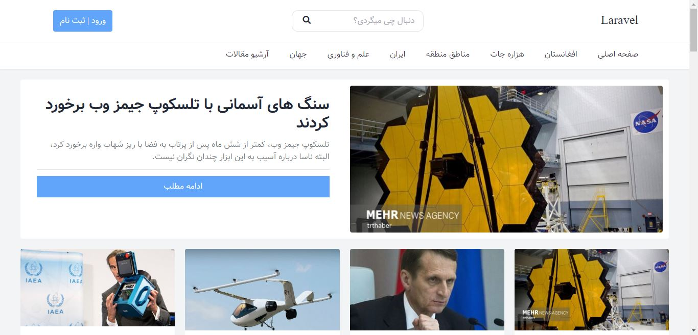
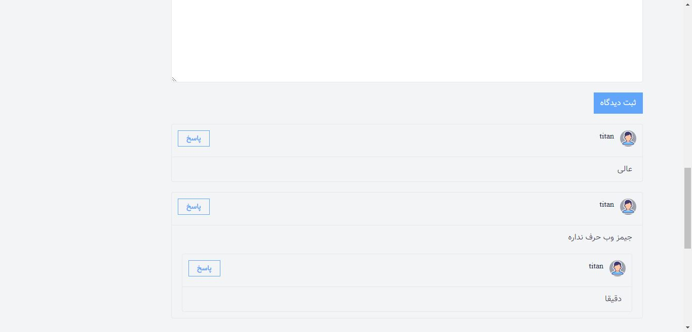
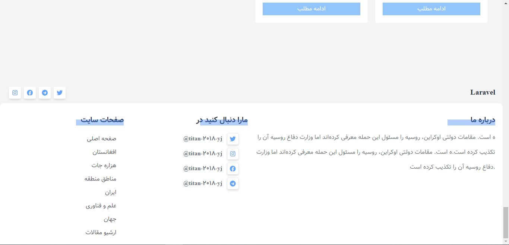
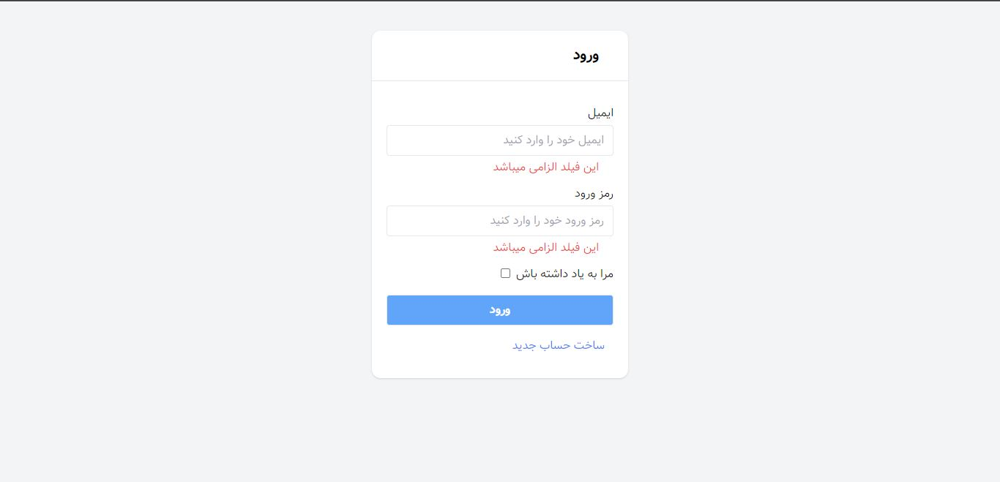
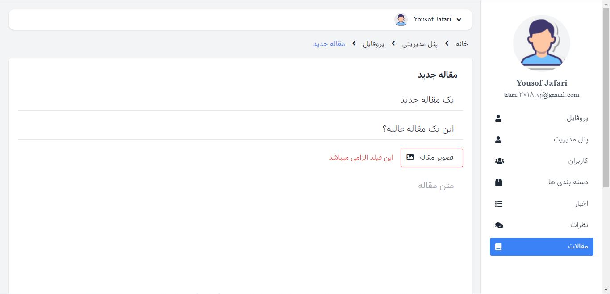
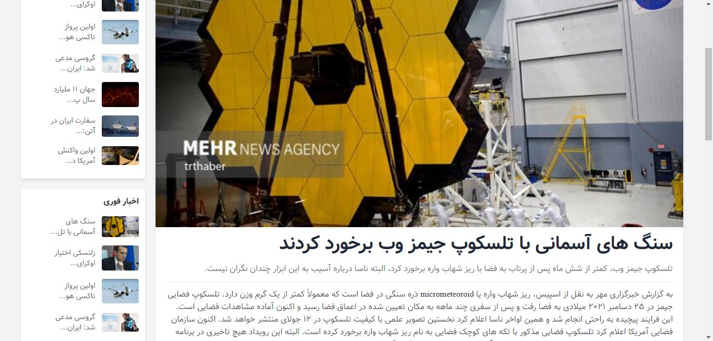
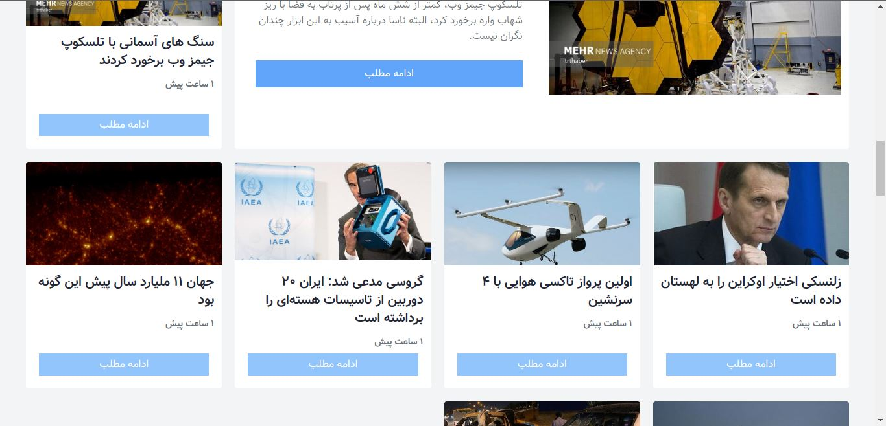
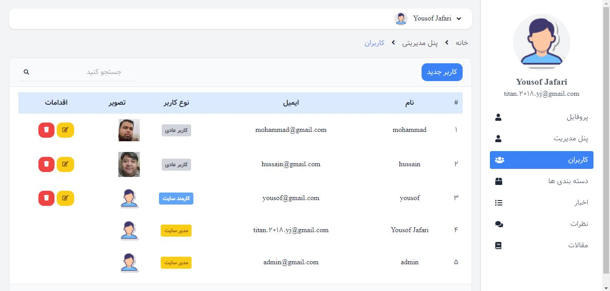
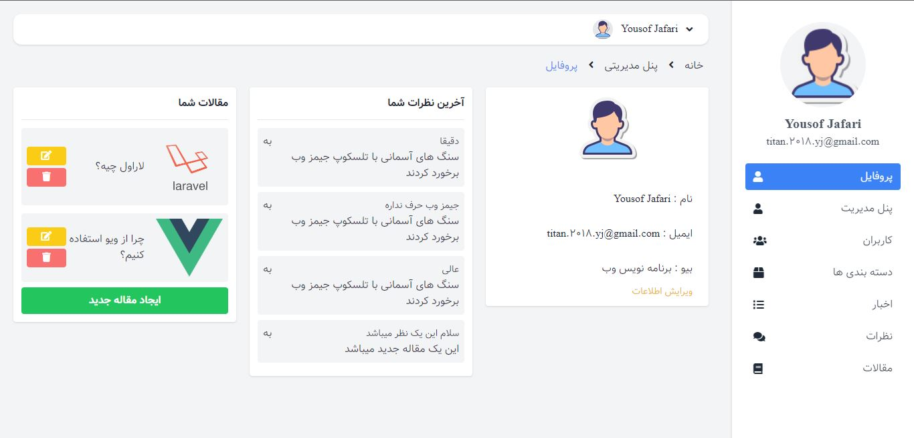

# ABOUT News Project
this is an advanced project created with laravel and livewire, in this website each registered user can upload topics. we have 3 types of user : { admin, staff, user }
admin control all the website.
staffs has some limited which is setted by admin.
users can only post new topics, comment, see posts and newses.

## In this project I have used
    tailwind css version 3
    php version 8.0.2
    laravel version 9.2
    livewire version 2.10

## Images

    
    
    
    
    
    
    
    
    

